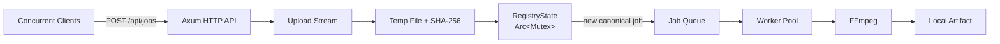
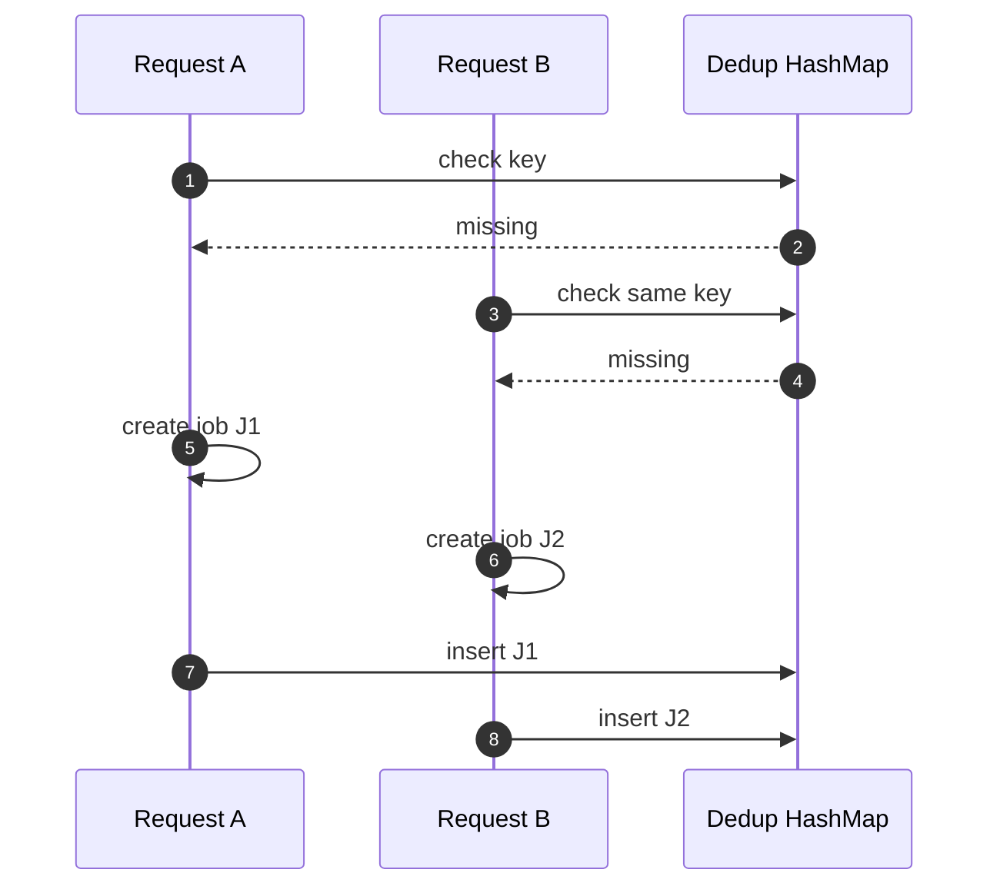
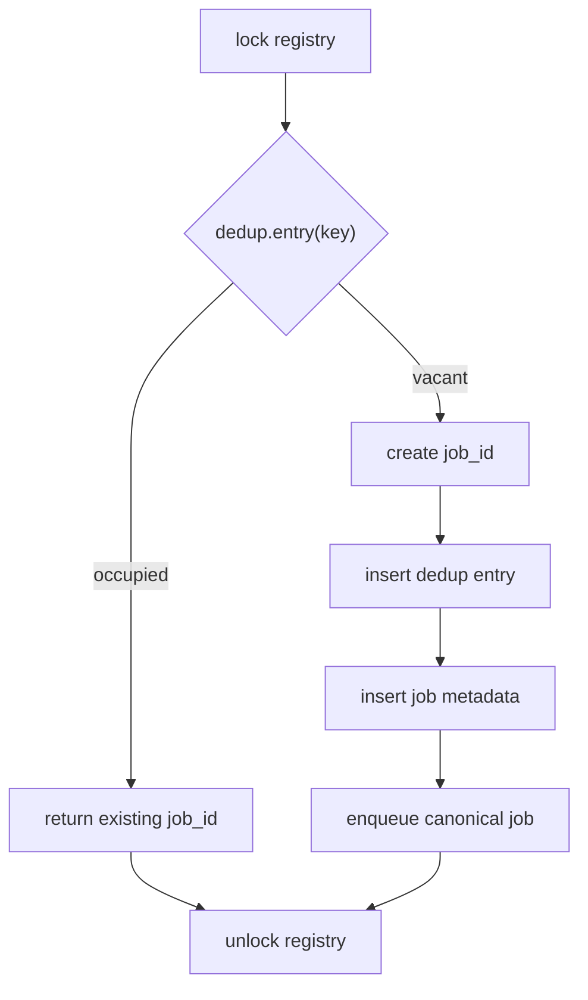
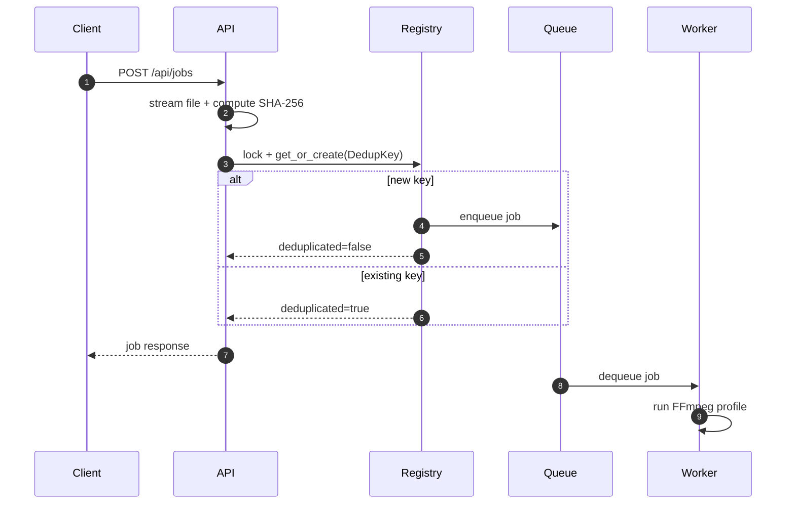
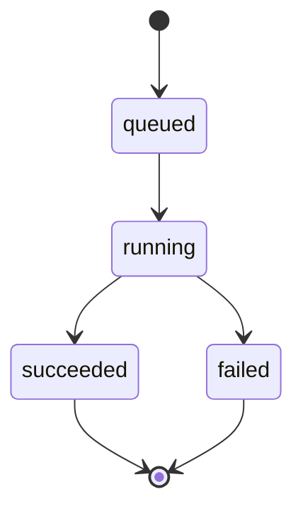

# Video Digest Server

Video Digest Server is a planned Rust/Tokio service for concurrent video uploads and FFmpeg transcoding.

When multiple clients upload the same video with the same profile, the target behavior is to create one canonical transcoding job and return that job ID to duplicate requests.

> Current status: design documentation only. Implementation will be added in later PRs.

## Core Idea

The service deduplicates work by this key:

```text
DedupKey = (content_sha256, profile_name)
```

The main concurrency issue is a logical check-then-insert race in an in-memory `HashMap`. This is an application-level race condition, not a Rust memory data race.

## System Overview



The target service is intentionally small: no database, no authentication, no session management, and no required UI. Runtime job state is kept in memory and is lost on restart.

## Race Condition

Naive check-then-insert can create duplicate jobs:



The planned fix is to perform lookup and insertion inside one mutex-protected critical section:



The mutex protects registry mutation only. Upload streaming, hashing, FFmpeg execution, and artifact download happen outside the lock.

## Request Flow



If an upload is interrupted, the hash is not finalized and no job is registered.

## Job States



Invalid transitions are rejected.

## API Surface

| Method | Path | Purpose |
|---|---|---|
| `GET` | `/api/health` | Health check |
| `POST` | `/api/jobs` | Upload video and create or reuse a job |
| `GET` | `/api/jobs` | List recent jobs |
| `GET` | `/api/jobs/{job_id}` | Read job status |
| `GET` | `/api/jobs/{job_id}/artifact` | Download succeeded artifact |

## Scope

| In scope | Out of scope |
|---|---|
| Rust/Tokio + Axum API | database persistence |
| multipart uploads | authentication |
| SHA-256 content hashing | session management |
| in-memory dedup registry | web dashboard |
| worker queue | distributed processing |
| YAML FFmpeg profiles | resumable upload |
| local filesystem artifacts | runtime profile reload |

## Documentation

- [Architecture](docs/ARCHITECTURE.md)
- [API specification](docs/API_SPEC.md)
- [Test plan](docs/TEST_PLAN.md)
